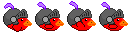

# Excalibird - Flappy Bird Clone

This is a sample of how to build a flappy bird style game in Excalibur.

## Running Locally

1. Install [node.js](https://nodejs.org/en/download/package-manager)
2. Clone the repository
3. Run `npm install` to install dependencies
4. Run `npm run dev` to start the Vite server!
5. Have fun!


## Tutorial

### Step 0 - Setting up Your TypeScript Environment


*You can skip this step if you have a preferred environment setup*

Setup your npm project with `npm init`, it will ask you for a series of questions and at the end you'll have a `package.json` file that describes how to run your project and it's dependencies

There are many ways to convert TypeScript into JavaScript so that it can be run by your browser. [Vite](https://vitejs.dev/) is a popular choice because of it's ease of use and smart defaults out of the box. So called a "zero-config" bundler, however you can provide a configuration if you need to.


Download `vite` and `typescript` via npm as dev dependencies, these are dependencies that are only needed at development time.

```sh
npm install vite typescript --save-exact --save-dev
```

Download `excalibur` via npm as a normal dependency

```sh
npm install excalibur --save-exact
```

In your `package.json` file modify your `scripts:` section to add a few scripts.

```json
"scripts": {
    "start": "vite",
    "build": "tsc && vite build",
    "serve": "vite preview"
},
```

* `npm run start` will start your app in dev mode and start a dev server you can browse to
* `npm run build` will first run the TypeScript compiler `tsc` to type check, then run `vite`'s build to produce output HTML/JS/CSS for production.
* `npm run serve` will just serve a dev server, good for checking production builds.

Create an `index.html` and a `main.ts`, with `vite` you can directly include a reference to your TypeScript files, normally you cannot do this without a bundler like `vite`.

```html
<!DOCTYPE html>
<html lang="en">
  <head>
    <meta charset="UTF-8" />
    <meta name="viewport" content="width=device-width, initial-scale=1.0" />
    <title>Excalibird</title>
  </head>
  <body>
    <script type="module" src="./src/main.ts"></script>
  </body>
</html>
```

### Step 1 - Start Your Engines

First in `main.ts` we can import all of Excalibur as `ex`, this makes it clear in this example what types are coming from Excalibur.

```typescript
// main.ts
import * as ex from 'excalibur'
```

You can certainly import individual types like this if you prefer, but for this tutorial we'll be doing the "barrel" `import * as ex`.

```typescript
import { Engine } from 'excalibur'
```

We can start by creating our `ex.Engine`, which will be the container for our game and drives the whole thing.

1. We can configure the width and height in pixels
2. We can configure the background color `#54C0CA`
3. There are different `ex.DisplayMode`'s, If you want to fit the width and height to the screen and keep aspect ratio, use `ex.DisplayMode.FitScreen`
4. If you want to avoid the letter boxing you can use `ex.DisplayMode.FitScreenAndFill`, only the configured width and height are safe to draw in but outside of that is not guaranteed.
5. In this sample we are using pixel art, so setting `pixelArt: true` will provide the best defaults for that.
5. Call `.start()` to start the game

```typescript
// main.ts
import { Engine } from 'excalibur'

const game = new ex.Engine({
  width: 400,
  height: 500,
  backgroundColor: ex.Color.fromHex("#54C0CA"),
  pixelArt: true,
  displayMode: ex.DisplayMode.FitScreen
});

game.start();
```

At this point the screen will just be a solid color we picked as our `backgroundColor`.

### Step 2 - Adding a Bird Actor

Next let's making our first Actor for the Bird and `.add()` it to the default Excalibur Scene which can be accessed off the `Engine`. 

`Actor` **must** be added to the scene to be drawn.

First create a new file `bird.ts`

1. We can give it a position x,y in pixels
2. We can give it a color yellow

```typescript
// bird.ts

import * as ex from "excalibur";

export class Bird extends ex.Actor {
    constructor({
        pos: ex.vec(200, 300),
        width: 16,
        height: 16
        color: ex.Color.Yellow
    })
}
```

Then we add it to our default scene.

```typescript
// main.ts 
const game = new ex.Engine({...});

const bird = new Bird();
game.add(bird); // adds the Bird Actor to the default scene

game.start();
```

Currently it doesn't do much for now but don't worry we'll get to it.


### Step 3 - The Bird and the Ground

Let's create some ground for the `Bird` to collide with, make a new `ground.ts` file.

We can use the `anchor` property to tell Excalibur how to align the default graphics and collider `(0, 0)` means top left, by default graphics and collider are centered around the position `pos`.

```typescript
// ground.ts
import * as ex from "excalibur";

export class Ground extends ex.Actor {
    constructor(pos: ex.Vector) {
        super({
            pos,
            anchor: ex.vec(0, 0),
            height: 64,
            width: 400,
            color: ex.Color.fromHex('#bd9853')
            z: 1 // position the ground above everything
        })
    }
}
```


We can make our `Bird` move by giving it some acceleration in `onInitialize`, it is generally recommended to initialize state in `onInitialize`. It makes testing easier and defers initialization until excalibur primitives are available. `onInitialize` is called once before the first update of the `Actor`.

*BTW n Excalibur the positive y axis points down!*

```typescript
// bird.ts
export class Bird extends ex.Actor {
    ...
    override onInitialize(): void {
        this.acc = ex.vec(0, 1200); // pixels per second per second
    }
}
```

Now we want to collide with the `Ground`.

```typescript
// bird.ts
export class Bird extends ex.Actor {
    ...

    override onCollisionStart(_self: ex.Collider, other: ex.Collider): void {
        if (other.owner instanceof Ground) {
            this.stop();
        }
    }

    stop() {
        this.vel = ex.vec(0, 0);
        this.acc = ex.vec(0, 0)
    }
}
```

Let's put our `Bird` and `Ground` together in the default `Scene`

```typescript
// main.ts
const game = new ex.Engine({...});

const bird = new Bird();
game.add(bird);

// drawHeight is the height of the visible drawing surface in game pixels
const ground = new Ground(ex.vec(0, engine.screen.drawHeight - 64));
game.add(ground);

game.start();
```


### Step 4 - Flying the Bird

We can take user input in Excalibur from keyboard, pointers (mouse, touch), and gamepads!

Let's setup an input handler to have the `Bird` jump when ever we hit the keyboard space bar or tap the screen. 

For added flair, we can adjust the `Bird`'s rotation by the speed that the level will be moving past `200` pixels per second.

```typescript
// bird.ts
export class Bird extends ex.Actor {

    ...

    jumping = false;

    private isInputActive(engine: ex.Engine) {
        // if the space bar or the first pointer was down
        return (engine.input.keyboard.isHeld(ex.Keys.Space) ||
                engine.input.pointers.isDown(0))
    }

    override onPostUpdate(engine: ex.Engine): void {
        if (!this.jumping && this.isInputActive(engine)) {
            this.vel.y += -800; // negative is UP
            this.jumping = true;
        }

        if (!this.isInputActive(engine)) {
            this.jumping = false;
        }

        // keep velocity from getting too big
        this.vel.y = ex.clamp(this.vel.y, -500, 500);

        // The "speed" the bird will move relative to pipes
        this.rotation = ex.vec(200, this.vel.y).toAngle();
    }

    ...

}
```

### Step 5 - Plumbing the Pipes

Now we want to make those classic "mario" style pipe obstacles you see in Flappy Bird.

First let's create a new `pipe.ts` file, pipes can either be on top of the screen or the bottom so we adjust our anchor accordingly.

Notice that the `Pipe` will be moving to the left 200 pixels per second relative to our `Bird`.

Then once offscreen we clean up after ourselves and remove the pipe with `.kill()`

```typescript
export class Pipe extends ex.Actor {
    constructor(pos: ex.Vector, public type: 'top' | 'bottom') {
        super({
            pos,
            width: 32,
            height: 1000,
            anchor: type === 'bottom' ?
                ex.vec(0, 0) : // bottom anchor from top left
                ex.vec(0, 1), // top anchor from the bottom left
            color: ex.Color.Green,
            vel: ex.vec(-200, 0),
            z: -1 // position the pipe under everything
        })

        this.on('exitviewport', () => this.kill());
    }
}
```

To make the `Bird` "collide" with our pipes we need to adjust our `onCollisionStart` to account for `Pipe`.

```typescript
// bird.ts
export class Bird extends ex.Actor {
    
    ...

    override onCollisionStart(_self: ex.Collider, other: ex.Collider): void {
        if (other.owner instanceof Ground ||
            other.owner instanceof Pipe
        ) {
            this.stop();
        }
    }

    ...

}
```

Let's add the `Pipe` into the default scene to test it out.

```typescript
// main.ts
const game = new ex.Engine({...});

const bird = new Bird();
game.add(bird);

// drawHeight is the height of the visible drawing surface in game pixels
const ground = new Ground(ex.vec(0, engine.screen.drawHeight - 64));
game.add(ground);

const topPipe = new Pipe(ex.vec(this.level.engine.screen.drawWidth, 150), 'top');
game.add(topPipe);

const bottomPipe = new Pipe(ex.vec(this.level.engine.screen.drawWidth, 300), 'bottom');
game.add(bottomPipe);

game.start();
```

### Step 6 - Refactor to a Scene

Up to this point we've been using the default scene, which is great for small prototypes. However we want to keep `main.ts` clean so we'll move our game composition and initialization logic into a `ex.Scene`.

Create a new file called `level.ts`, we can put our initialization logic in `onInitialize` this will be called once before the scene is shown for the first time. If you need to have logic run when the scene is shown every time look at `onActivate` and `onDeactivate`.

It is often useful to stash common logic for your game in a scene, for example restarting, game over, saving state, etc.

```typescript
// level.ts
export class Level extends ex.Scene {
    bird: Bird = new Bird();
    ground!: Ground;
    override onInitialize(engine: ex.Engine): void {
        this.add(this.bird);

        this.ground = new Ground(ex.vec(0, engine.screen.drawHeight - 64))
        this.add(this.ground);

        const topPipe = new Pipe(ex.vec(this.level.engine.screen.drawWidth, 150), 'top');
        game.add(topPipe);

        const bottomPipe = new Pipe(ex.vec(this.level.engine.screen.drawWidth, 300), 'bottom');
        game.add(bottomPipe);
    }
}
```

Now in our `main.ts` we register the scene and go to the named scene after we start

```typescript
// main.ts
const game = new ex.Engine({
  ...
  scenes: { Level: Level }
});
...
game.start().then(() => {
  game.goToScene('Level');
});
```

### Step 7 - Refactor to Config Constants

Using magic numbers in your code can start to get tricky as your code base grows. We recommend creating a `config.ts` file to hold these numbers with names that mean something to you and your game.

We go through and move all our numbers into this file. 

```typescript
// config.ts

export const Config = {
    BirdStartPos: ex.vec(200, 300),
    BirdAcceleration: 1200,
    BirdJumpVelocity: -800,
    BirdMinVelocity: -500,
    BirdMaxVelocity: 500, 
    PipeSpeed: 200,
    PipeInterval: 1500,
    PipeGap: 150
} as const;

```

You might have noticed an `as const`. This tells TypeScript that this `Config` object will never change at runtime and you can count on the keys being there which is useful for configuration.

### Step 8 - Periodic Pipes

We want pipe to appear after a certain amount of time and for them to be in random positions. To accomplish this we'll use the `ex.Timer` which is a handy type for firing a callback periodically according to the excalibur `Clock` and `ex.Random` which provides a way of doing seeded random.

`ex.Timer`'s can be created and configured to `repeats:` infinitely at a certain `interval:`, and call a callback `fcn:`.

```typescript
this.timer = new ex.Timer({
    interval: intervalMs,
    repeats: true,
    fcn: () => this.spawnPipes()
});
// MUST BE added to a scene to work
this.level.add(this.timer);

```

Let's create a new type that's responsible for creating our `Pipe`s, we'll call it `PipeFactory`.

Create a new file `pipe-factory.ts`, note that this type is a plain old TypeScript/JavaScript class not extending any excalibur types.

The `spawnPipes()` method creates the top and bottom pipe using a random floating point number between 0 and the height of the screen taking into account the gap we want between pipes with `Config.PipeGap`.

We can `.start()`, `.stop()` the pipe factory and all the `Pipe`s created at the same time, also we added a `.reset()` which will come in handy later when we want to restart the game.


```typescript
// pipe-factory.ts
export class PipeFactory {

    private timer: ex.Timer;
    constructor(
        private level: Level,
        private random: ex.Random,
        intervalMs: number) {

            this.timer = new ex.Timer({
                interval: intervalMs,
                repeats: true,
                fcn: () => this.spawnPipes()
            });

            this.level.add(this.timer);
    }

    spawnPipes() {
        const randomPipePosition = this.random.floating(0, this.level.engine.screen.drawWidth - Config.PipeGap);

        const bottomPipe = new Pipe(
            ex.vec(this.level.engine.screen.drawWidth, randomPipePosition + Config.PipeGap),
            'bottom'export class Level extends ex.Scene {
    score: number = 0;
    best: number = 0;
    random = new ex.Random();
    pipeFactory = new PipeFactory(this, this.random, Config.PipeInterval);
    bird = new Bird(this);
    ground!: Ground;
        );
        this.level.add(bottomPipe);

        const topPipe = new Pipe(
            ex.vec(this.level.engine.screen.drawWidth, randomPipePosition),
            'top'
        );
        this.level.add(topPipe);
    }

    start() {
        this.timer.start();
    }

    reset() {
        for (const actor of this.level.actors) {
            if (actor instanceof Pipe) {
                actor.kill();
            }
        }
    }

    stop() {
        this.timer.stop();
        for (const actor of this.level.actors) {
            if (actor instanceof Pipe) {
                actor.vel = ex.vec(0, 0);
            }
        }
    }
}
```

With this new `PipeFactory` we'll add it to our `Level` with a new `ex.Random`. If no seed is provided to `new ex.Random()` it'll use `Date.now()`

```typescript
// level.ts
export class Level extends ex.Scene {
    random = new ex.Random();
    pipeFactory = new PipeFactory(this, this.random, Config.PipeInterval);
    bird = new Bird(this);
    ground!: Ground;

    onInitialize(engine: ex.Engine): void {
        ...

        this.pipeFactory.start();
    }
}
```


### Step 9 - Scoring Points!

Any good game needs points, so let's add some!

First we'll add a score label and best score to our `Level` to keep track of the current score for us. Additionally we'll add an `incrementScore()` to up the value. We can use the browser's `localStorage` feature to keep track of our best score.

```typescript
// level.ts
export class Level extends ex.Scene {
    ...
    score: number = 0;
    best: number = 0;
    scoreLabel = new ex.Label({
        text: 'Score: 0',
        x: 0,
        y: 0,
        z: 1,
        font: new ex.Font({
            size: 20,
            color: ex.Color.White
        })
    });

    bestLabel = new ex.Label({
        text: 'Best: 0',
        x: 400,
        y: 0,
        z: 1,
        font: new ex.Font({
            size: 20,
            color: ex.Color.White,
            textAlign: ex.TextAlign.End
        })
    });

    onInitialize(engine: ex.Engine): void {
        ...

        this.add(this.scoreLabel);
        this.add(this.bestLabel);

        const bestScore = localStorage.getItem('bestScore');
        if (bestScore) {
            this.best = +bestScore;
            this.setBestScore(this.best);
        } else {
            this.setBestScore(0);
        }
    }

    incrementScore() {
        this.scoreLabel.text = `Score: ${++this.score}`;
        this.setBestScore(this.score);
    }

    setBestScore(score: number) {
        if (score > this.best) {
            localStorage.setItem('bestScore', this.score.toString());
            this.best = score;
        }
        this.bestLabel.text = `Best: ${this.best}`;
    }
}
```

When our `Bird` flies between two pipes we want to increment the score. To do this will create a new file `score-trigger.ts` to detect this.

```typescript
// score-trigger.ts
export class ScoreTrigger extends ex.Actor {
    constructor(pos: ex.Vector, private level: Level) {
        super({
            pos,
            width: 32,
            height: Config.PipeGap,
            anchor: ex.vec(0, 0),
            vel: ex.vec(-Config.PipeSpeed, 0)
        })

        this.on('exitviewport', () => {
            this.kill();
        });
    }

    override onCollisionStart(): void {
        this.level.incrementScore();
    }
}
```

Now in our pipe factory we put these triggers in between our pipes, and add `ScoreTrigger` to our `reset()` and `stop()` routines


```typescript
// pipe-factory.ts

export class PipeFactory {
    ...

    spawnPipes() {
        ...

        const scoreTrigger = new ScoreTrigger(
            ex.vec(
                this.level.engine.screen.drawWidth,
                randomPipePosition),
            this.level
        );
        this.level.add(scoreTrigger);

    }

    ...
    reset() {
        for (const actor of this.level.actors) {
            if (actor instanceof Pipe ||
                actor instanceof ScoreTrigger
            ) {
                actor.kill();
            }
        }
    }

    stop() {
        this.timer.stop();
        for (const actor of this.level.actors) {
            if (actor instanceof Pipe ||
                actor instanceof ScoreTrigger
            ) {
                actor.vel = ex.vec(0, 0);
            }
        }
    }
}
```

### Step 10 - Game Over

For our game, when the bird collides with the ground, pipe, or goes offscreen we want to trigger a game over. To accomplish this we'll setup a `start()`, `stop()` and `reset()` on the various components of our game so that we can "freeze" things in place on a game over.

We implement a `showStartInstructions()` method that shows our start game label and starts the game as soon as a pointer is tapped.

We'll show the start instructions at the beginning and on a game over.


```typescript
// level.ts
export class Level extends ex.Scene {
    ...

    startGameLabel = new ex.Label({
        text: 'Tap to Start',
        x: 200,
        y: 200,
        z: 2,
        font: new ex.Font({
            size: 30,
            color: ex.Color.White,
            textAlign: ex.TextAlign.Center
        })
    });

    override onInitialize(engine: ex.Engine): void {
        ...
        this.showStartInstructions();
    }

    showStartInstructions() {
        this.startGameLabel.graphics.visible = true;
        this.engine.input.pointers.once('down', () => {
            this.reset();

            this.startGameLabel.graphics.visible = false;
            this.bird.start();
            this.pipeFactory.start();
            this.ground.start();
        });
    }

    reset() {
        this.bird.reset();
        this.pipeFactory.reset();
        this.score = 0;
        this.scoreLabel.text = `Score: ${this.score}`;
    }

    triggerGameOver() {
        this.pipeFactory.stop();
        this.bird.stop();
        this.ground.stop();
        this.showStartInstructions();
    }
}
```

In our `Bird` we want to trigger this game over when it leaves the screen and when it collides with a `Pipe` or the `Ground`

```typescript
// bird.ts
export class Bird extends ex.Actor {
    playing = false;
    ...

    override onInitialize(): void {
        ...
        this.on('exitviewport', () => {
            this.level.triggerGameOver();
        });
    }

    override onPostUpdate(engine: ex.Engine): void {
        if (!this.playing) return;
        ...
    }

    start() {
        this.playing = true;
        this.pos = Config.BirdStartPos; // starting position
        this.acc = ex.vec(0, Config.BirdAcceleration); // pixels per second per second
    }

    reset() {
        this.pos = Config.BirdStartPos; // starting position
        this.stop();
    }

    stop() {
        this.playing = false;
        this.vel = ex.vec(0, 0);
        this.acc = ex.vec(0, 0);
    }

    override onCollisionStart(_self: ex.Collider, other: ex.Collider): void {
        if (other.owner instanceof Pipe ||
            other.owner instanceof Ground
        ) {
            this.level.triggerGameOver();
        }
    }
}

```

### Step 11 - Graphics 

It would be nice to have some graphics for our `Bird` actor, we can load images to use in in actors using the `ex.ImageSource` and a `ex.Loader`. The loader will show a loading bar while our images and other resources are loading. Generally we do this in a new `resources.ts` file.

1. We export the Resources `as const` so you get strong typing for each key of the dictionary, `as const` tells typescript that the keys wont change at runtime
2. Another useful convention that we use is defining the loader next to the Resources and exporting to be used in `main.ts`
3. Note: in vite to serve static files we use the `public` folder


```typescript
// resources.ts
export const Resources = {
    // Relative to /public in vite
    BirdImage: new ex.ImageSource('./images/bird.png')
} as const;
```

Now we can load this before starting the game

```typescript
// main.ts
...
const loader = new ex.Loader(Object.values(Resources));
game.start(loader).then(() => {
  game.goToScene('Level');
});
```

### Step 11 - Bird Graphics

We have a lovely Excalibur themed bird we created especially for this sample, feel free to use and remix. You'll notice that we have a sprite sheet for various frames.




To slice this up into animations we can use `ex.SpriteSheet` and `ex.Animation`. Animations can have a particular `ex.AnimationStrategy`
* Freeze - stops on the last frame
* Loop - starts from the beginning again after the last frame
* PingPong - plays to the last frame, then in reverse, and so on
* End - after the last frame nothing is drawn

```typescript

// Slice up image into a sprite sheet
const spriteSheet = ex.SpriteSheet.fromImageSource({
    image: Resources.BirdImage,
    grid: {
        rows: 1,
        columns: 4,
        spriteWidth: 32,
        spriteHeight: 32,
    }
});

// Animation to play going up on tap
this.upAnimation = ex.Animation.fromSpriteSheet(
    spriteSheet,
    [2, 1, 0], // 3rd frame, then 2nd, then first
    150, // 150ms for each frame
    ex.AnimationStrategy.Freeze);

// Animation to play going down
this.downAnimation = ex.Animation.fromSpriteSheet(
    spriteSheet,
    [0, 1, 2],
    150,
    ex.AnimationStrategy.Freeze);

// Register animations by name
this.graphics.add('down', this.downAnimation);
this.graphics.add('up', this.upAnimation);
```

You can also pull single frames out of a `SpriteSheet` as a `Sprite`

```typescript
this.startSprite = spriteSheet.getSprite(1, 0);
...
this.graphics.add('start', this.startSprite);

this.graphics.use('start');
```

### Step 12 - Pipe Graphics

We also created a pipe especially for this sample, feel free to use and remix.


We can take advantage of `ex.ImageWrapping.Clamp` to stretch the bottom pixel of the pipe so it can be as long as we want.

```typescript
// resources.ts
export const Resources = {
    // Relative to /public in vite
    ...
    PipeImage: new ex.ImageSource('./images/pipe.png', {
        wrapping: ex.ImageWrapping.Clamp
    }),
    ...
} as const;
```

In our `pipe.ts` we can add our pipe graphic and stretch it by changing the `sourceView` and `destSize`. 

The `sourceView` is the "window" into the original image, and since we are specifying a view larger than the original image, that `ex.ImageWrap.Clamp` will stretch the board pixel to accommodate. 

Changing the `destSize` changes the size of the final rendered sprite, in this case we want the same height.

```typescript
// pipe.ts
export class Pipe extends ex.Actor {
    ...

    override onInitialize(): void {
        const pipeEnd = Resources.PipeImage.toSprite();
        // Stretch the pipe sprite
        // by default ImageSource use clamp which re-uses the border pixels 
        // when sourceView is larger than the original image
        pipeEnd.sourceView.height = 1000;
        // 
        pipeEnd.destSize.height = 1000;

        // Flip the pipe sprite
        if (this.type === 'top') {
            pipeEnd.flipVertical = true;
        }
        this.graphics.use(pipeEnd);
    }
}
```

### Step 13 - Ground Graphics

Finally the ground graphics, feel free to use and remix.


We want the ground to tile and repeat horizontally we can take advantage of the `ex.ImageWrapping.Repeat` to accomplish this

```typescript
// resources.ts
export const Resources = {
    // Relative to /public in vite
    GroundImage: new ex.ImageSource('./images/ground.png', {
        wrapping: ex.ImageWrapping.Repeat
    })
} as const;
```

When the `ex.ImageWrapping.Repeat` mode is set, specifying a bigger `sourceView` than the original image has a tiling effect, the original image gets repeated over and over.

```typescript
// ground.ts
    onInitialize(engine: ex.Engine): void {
        this.groundSprite.sourceView.width = engine.screen.drawWidth;
        this.groundSprite.destSize.width = engine.screen.drawWidth;
        this.graphics.use(this.groundSprite);
    }
```

To make the ground appear scroll to the left, we can do a nifty trick to move the `sourceView.x` by the speed of our `Pipe`

```typescript
    onPostUpdate(_engine: ex.Engine, elapsedMs: number): void {
        if (!this.moving) return;
        this.groundSprite.sourceView.x += Config.PipeSpeed * (elapsedMs / 1000);
        this.groundSprite.sourceView.x = this.groundSprite.sourceView.x % Resources.GroundImage.width;
    }
```

Putting it all together

```typescript
// ground.ts
export class Ground extends ex.Actor {
    groundSprite = Resources.GroundImage.toSprite();
    moving = false;
    constructor(pos: ex.Vector) {
        super({
            pos,
            anchor: ex.vec(0, 0),
            height: 64,
            width: 400,
            z: 1
        })
    }

    onInitialize(engine: ex.Engine): void {
        this.groundSprite.sourceView.width = engine.screen.drawWidth;
        this.groundSprite.destSize.width = engine.screen.drawWidth;
        this.graphics.use(this.groundSprite);
    }

    onPostUpdate(_engine: ex.Engine, elapsedMs: number): void {
        if (!this.moving) return;
        this.groundSprite.sourceView.x += Config.PipeSpeed * (elapsedMs / 1000);
        this.groundSprite.sourceView.x = this.groundSprite.sourceView.x % Resources.GroundImage.width;
    }

    start() {
        this.moving = true;
    }

    stop() {
        this.moving = false;
    }
}
```

### Step 14 - Flappy Sounds and Music

